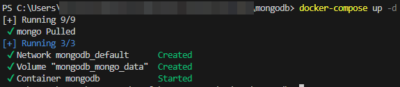
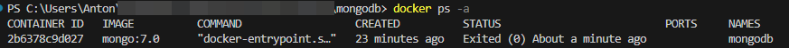
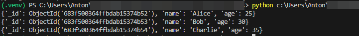

## Задание 1.4 Развертывание БД Mongo с помощью Docker

docker-compose.yml для развертывания БД:

```yaml
services:
  mongo:
    image: mongo:7.0
    container_name: mongodb
    restart: unless-stopped
    environment:
      MONGO_INITDB_ROOT_USERNAME: root
      MONGO_INITDB_ROOT_PASSWORD: pwdadmin
    ports:
      - "27017:27017"
    volumes:
      - mongo_data:/data/db

volumes:
  mongo_data:
```

Команда для сборки и запуска контейнера:

```bash
docker-compose up -d
```

Результат работы:
<br>

<br>
Контейнер:
<br>


Python скрипт для подключения к БД, вставки и получения данных:

```python
from pymongo import MongoClient

from pymongo import MongoClient

class MongoDBConnectManager(object):
    def __init__(self, host="localhost", port=27017, username="root", password="pwdadmin"):
        """
        Initializes the MongoDBConnectManager with the given connection parameters.

        :param host: The url of the MongoDB server
        :param username: The username to use for authentication
        :param password: The password to use for authentication
        :return: a MongoDBConnectManager instance
        """
        self.host = host
        self.port = port
        self.username = username
        self.password = password
        self.connection = None

    def __enter__(self):
        self.connection = MongoClient(
            self.host, self.port,
            username=self.username,
            password=self.password,
            authSource="admin",
            authMechanism="SCRAM-SHA-1"
        )
        return self

    def __exit__(self, exc_type, exc_value, traceback):
        self.connection.close()


def main():
    with MongoDBConnectManager() as mongo:
        db = mongo.connection["mydatabase"]
        collection = db["users"]

        # Вставка данных
        collection.insert_many([
            {"name": "Alice", "age": 25},
            {"name": "Bob", "age": 30},
            {"name": "Charlie", "age": 35}
        ])

        # Получение данных
        for item in collection.find():
            print(item)


if __name__ == "__main__":
    main()
```

Вывод программы:
<br>

