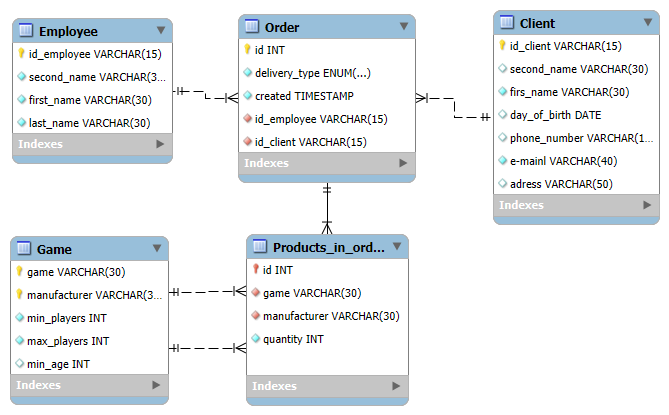

# Самостоятельная работа №3
Тема: Нормальные формы
## Отчёт

### Задание 3.1
Определите потенциальные ключи для каждого из отношений. Если для
каких-то отношений таких ключей окажется несколько, выберите один из них
на роль первичного (PK), а остальные пометьте альтернативными (AK).

*1. Напомним, что потенциальным ключом считается минимальный набор атрибутов,
позволяющий уникально идентифицировать каждый кортеж отношения: сочетание
значений этих атрибутов не может повторяться в рамках отношения в любом из его
допустимых состояний (а не только для исходного набора данных).
 
2. Под минимальностью понимается тот факт, что ни один из атрибутов не может
быть удалён из рассматриваемого набора без потери оставшимися свойства уникальности
совокупных значений. При этом в разных потенциальных ключах может быть разное
количество атрибутов (например, в одном – один, в другом – три).*

---

К (Клиент)
| **Ид клиента (PK)** | Фамилия |  Имя   | Дата рождения |     Телефон      |      Почта (АК)      |           Адрес          |
|:-------------------:|:-------:|:------:|:-------------:|:----------------:|:--------------------:|:------------------------:|
| К1                  | Петров  | Архип  |               | 8-904-237-56-37  | arpetr@mail.ru       | ул. Пионерская, 26-58    |
| К2                  | Швыркин | Михаил | 12.05.1996    | 8-921-333-24-24  | m.shvyrkin@gmail.com | ул. Васи Зайцева,   14-6 |

И (Игра)
| **Название (PK)** | **Производитель (PK)** | Мин игроков | Макс игроков | Мин возраст |
|:-----------------:|------------------------|:-----------:|:------------:|:-----------:|
| Диксит            | Libellud               | 3           | 6            | 8           |
| Диксит            | Asmodee                | 3           | 6            | 12          |
| Монополия         | Hasbro Inc.            | 2           | 6            | 8           |
| Барбосики         | Asmodee                | 2           | 4            |             |

З (Заказ)
| **Номер   (PK)** | Получение |   Создан (АК)   | Таб номер | Ид клиента (АК) |
|:----------------:|:---------:|:---------------:|:---------:|:---------------:|
| 1                | Самовывоз | 12,09,16        | C01       | К1              |
| 2                | Самовывоз | 12,09,16        | C01       | К2              |
| 3                | Доставка  | 13,09,16        | C02       | К2              |

С (Сотрудник)
| **Таб номер   (PK)** |   Фамилия (АК)   |   Имя (АК)   |   Отчество (АК)   |   Ид клиента (АК)   |
|:--------------------:|:----------------:|:------------:|:-----------------:|:-------------------:|
| С01                  | Петренко         | Владимир     | Кириллович        | К1                  |
| С02                  | Веллингтон       | Артур        | Арутюнович        | К2                  |

ПЗ (Позиция заказа)
| **Номер заказа (PK)** | **Название игры (PK)** | **Производитель   (PK)** | Кол-во |
|:---------------------:|:----------------------:|:------------------------:|:------:|
| 1                     | Диксит                 | Asmodee                  | 1      |
| 1                     | Диксит                 | Libellud                 | 1      |
| 2                     | Монополия              | Hasbro Inc.              | 1      |
| 3                     | Диксит                 | Libellud                 | 2      |
| 3                     | Монополия              | Hasbro Inc.              | 4      |

### Задание 2
Определите, какие из атрибутов отношений являются обязательными, т.е. не допускают наличие неизвестных значений. Пометьте такие атрибуты как NOT NULL (NN).

*Для атрибутов, входящих в состав первичного ключа данную пометку можно не ставить,
т.к. они являются обязательными по определению.*

---

К (Клиент)
| **Ид   клиента (PK)** | Фамилия (NN) |  Имя   | Дата рождения |     Телефон     |    Почта (АК) (NN)   |           Адрес          |
|:---------------------:|:------------:|:------:|:-------------:|:---------------:|:--------------------:|:------------------------:|

И (Игра)
| **Название   (PK)** | **Производитель   (PK)** | Мин игроков (NN) | Макс игроков | Мин возраст |
|:-------------------:|--------------------------|:----------------:|:------------:|:-----------:|

З (Заказ)
| **Номер (PK)** | Получение (NN) | Создан (АК) (NN) | Таб номер (NN) | Ид клиента (АК) (NN) |
|:--------------:|:--------------:|:----------------:|:--------------:|----------------------|

С (Сотрудник)
| **Таб номер (PK)** | Фамилия (АК) (NN) | Имя (АК) (NN) | Отчество (АК) |
|:------------------:|:-----------------:|:-------------:|:-------------:|

ПЗ (Позиция заказа)
| **Номер заказа (PK)** | **Название игры (PK)** | **Производитель (PK)** | Кол-во (NN) |
|:---------------------:|:----------------------:|:----------------------:|:-----------:|

### Задание 3
Определите условия проверки значений для атрибутов (где возможно и, на ваш взгляд, имеет смысл). Условия требуется записать в виде логического выражения (предиката), в левой части которого указано имя атрибута, а в правой – значения, с которыми требуется произвести сравнение. Допускается использование реляционных (>, <, >=, <=, =, !=) и логических (AND, OR) операторов, а также оператора LIKE в том синтаксисе, с которым вы познакомились при выполнении лабораторной работы второй недели.

* *Например, для атрибута “Мин игроков” в сущности ИГРА будет следующая запись
Мин игроков >=1.*
* *При использовании LIKE не забывайте использовать апострофы, например: <имя
атрибута> LIKE ‘определение’*
* *При использовании логических операторов «имя атрибута» повторяется, например:
<имя атрибута> = ‘определение’ OR <имя атрибута> = ‘определение’*

---

<ul>
    <li>
        К.Ид клиента => x != Ид клиента
    </li>
    <li>
        К.Фамилия LIKE '__%' 
    </li>
    <li>
        К.Почта LIKE '%@%mail%' AND NOT LIKE '% %'
    </li>
    <li>
        И.Название LIKE '_%'
    </li>
    <li>
        И.Производитель LIKE '_%'
    </li>
    <li>
        И.Мин игроков >= 1
    </li>
    <li>
        З.Получение LIKE '________%'
    </li>
    <li>
        З.Создан LIKE '__ . __ . __%'
    </li>
    <li>
        С.Таб номер != Таб номер
    </li>
    <li>
        С.Фамилия LIKE '_%'
    </li>
    <li>
        С.Имя LIKE '_%'
    </li>
    <li>
        ПЗ.Название игры LIKE '_%'
    </li>
    <li>
        ПЗ.Кол-во >= 1
    </li>
</ul>

### Задание 4

Определите связи между отношениями.

*Для определения типа связи (один-к-одному, один-ко-многим или многие-ко-многим)
между двумя отношениями, проверьте для каждого из них: со сколькими кортежами
второго отношения может быть связан один кортеж проверяемого. Для упрощения
формулируйте фразы, которые однозначно определяют связь между отношениями.
Например, для связи между отношениями ЗАКАЗ и СОТРУДНИК, фразы могут быть
следующими:*
* *один заказ должен быть обработан ОДНИМ сотрудником*
* *один сотрудник может вести МНОГО заказов*

---

* один заказ может быть оформлен ОДНИМ клиентом
* один клиент может оформить МНОГО заказов

* у одного заказа может быть МНОГО позиций

* одна название игры может быть у МНОГИХ позиций
* один производитель может быть у МНОГИХ позиций

* один заказ должен быть обработан ОДНИМ сотрудником
* один сотрудник может вести МНОГО заказов

### Задание 5
Установите связь между отношениями, добавив атрибуты первичного ключа главного отношения (того, к которому относится слово ОДИН) в состав дочернего (того, к которому относится слово МНОГО) и отметив их как внешний ключ (FK).
*При получении связи типа многие-ко-многим, не забудьте, что она должна быть разбита с образованием нового, промежуточного отношения, в которое могут быть добавлены атрибуты, дополнительно характеризующие связь.*

К (Клиент)
| **Ид   клиента (PK)** | Фамилия (NN) |  Имя   | Дата рождения |     Телефон     |    Почта (АК) (NN)   |           Адрес          |
|:---------------------:|:------------:|:------:|:-------------:|:---------------:|:--------------------:|:------------------------:|

З (Заказ)
| **Номер (PK)** | Получение (NN) | Создан (АК) (NN) | Таб номер (NN) | Ид клиента (АК) (NN) (FK) |
|:--------------:|:--------------:|:----------------:|:--------------:|----------------------|

---

И (Игра)
| **Название (PK)** | **Производитель (PK)** | Мин игроков (NN) | Макс игроков | Мин возраст |
|:-------------------:|--------------------------|:----------------:|:------------:|:-----------:|

ПЗ (Позиция заказа)
| **Номер заказа (PK)** | **Название игры (PK) (FK)** | **Производитель (PK) (FK)** | Кол-во (NN) |
|:---------------------:|:---------------------------:|:---------------------------:|:-----------:|

---

З (Заказ)
| **Номер (PK)** | Получение (NN) | Создан (АК) (NN) | Таб номер (NN) | Ид клиента (АК) (NN) |
|:--------------:|:--------------:|:----------------:|:--------------:|----------------------|

ПЗ (Позиция заказа)
| **Номер заказа (PK) (FK)** | **Название игры (PK)** | **Производитель (PK)** | Кол-во (NN) |
|:--------------------------:|:----------------------:|:----------------------:|:-----------:|

---

С (Сотрудник)
| **Таб номер (PK)** | Фамилия (АК) (NN) | Имя (АК) (NN) | Отчество (АК) |
|:------------------:|:-----------------:|:-------------:|:-------------:|

З (Заказ)
| **Номер (PK)** | Получение (NN) | Создан (АК) (NN) | Таб номер (NN) (FK) | Ид клиента (АК) (NN) |
|:--------------:|:--------------:|:----------------:|:--------------:|----------------------|

### Задание 6
Проверьте добавленные при установке связей атрибуты на обязательность, пометьте их как NOT NULL, если это требуется. Проверьте, не появились ли новые потенциальные ключи в результате добавления новых атрибутов.

---

Связи атрибутов между отношениями происходят только от первичных ключей, которые автоматически обязательны.
Так как в отношении присутствуют связи только один-к-многим, то в данном случае они не могут стать потенциальным ключом.

### Задание 7
Допустим, что каждый сотрудник может обработать только один заказ (после чего его увольняют ). В этом случае, связь между отношениями ЗАКАЗ и СОТРУДНИК трансформируется в один-к-одному. Что нужно будет сделать дополнительно для поддержки этой связи? Что может помешать указать одного и того же сотрудника в отношении ЗАКАЗ, ответственным за обработку нескольких разных заказов?

---

Так как один сотрудник может обрабатывать только один заказ (добавлен в отношение только один раз), то значение атрибута Таб номер в отношении Заказ должно стать уникальным.
